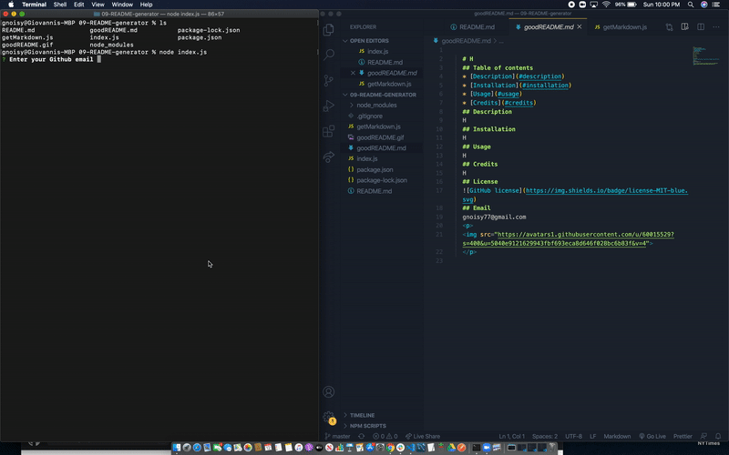

# 09-README-generator



This is an application that lets the user dynamically generate a README.md file using the command line interface.

## Deployed Link

* [See Live Site](https://gnoisy.github.io/09-README-generator/)

## Prerequisites

You'll need an IDE such as VS Code or Atom. Copy and paste code into your IDE and you can save file to your local drive.

```
https://code.visualstudio.com/download

https://flight-manual.atom.io/getting-started/sections/installing-atom/
```

## Built With

* [Javascript](https://developer.mozilla.org/en-US/docs/Web/JavaScript)
* [Node.js](https://nodejs.org/en/)
* [Inquirer.js](https://www.npmjs.com/package/inquirer#questions)


## Authors

* **Giovanni Noisy**

- [Github](https://github.com/GNoisy)
- [LinkedIn](https://www.linkedin.com/in/giovanni-noisy-04098989/)

### Acknowledgments

* MDN 
* Google
* Youtube
  